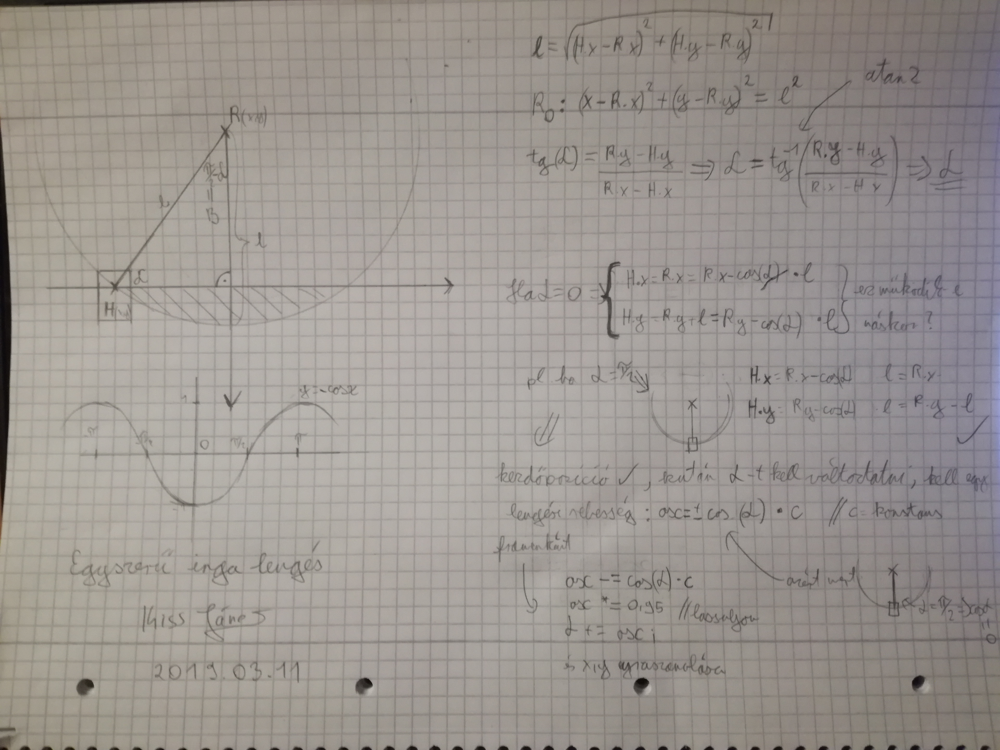

# Jumpy Rope  

This is a game for one of my university class.  
2D platformer, where you have to collect all the coins in every level.  
But the main mechanic is that you  have  a rope which you can use to sway like a pendulum.  

## Update  
- added new object: SPIKE  
    - if you touch the spike you die and a Tombstone spawns in your place.  
    - after you died, you respawn at the beginning in the map ( you hold on to your coins)  

- added new object: TOMBSTONE
    - the Tombstone spawns every to when you die somewhere, and it has a counter, counting your number of deaths  

- Modified maps, now there are spikes in them

- Reworked update functions for the playen and the wall
    - now they use the ***state machine*** development pattern
    - Because of this now the code is more read friendly
    - and the performance gor better
- Added funky electro-swing music
	- origin : https://www.youtube.com/watch?v=VC9b2E-imzw&feature=youtu.be&list=RDj7ZggaUbVlI

### Picture from the states:

### how I calculated the pendulum (picture):

